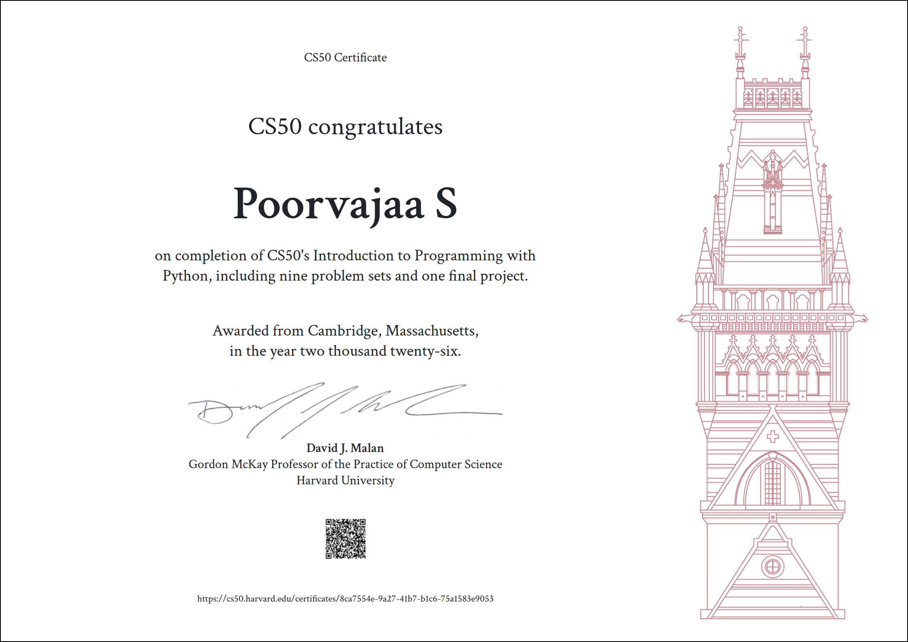

# CS50P — Introduction to Programming with Python

> Harvard University · CS50's Introduction to Programming with Python
> All problem sets solved, documented, and version-controlled.

---

## 📖 What This Is

This repository documents my completion of Harvard's CS50P course through fully working solutions to every problem set, plus an original final project. It demonstrates my ability to read technical specifications, write clean Python, handle edge cases, and produce code that satisfies automated test suites.

---

## 🐍 Course Overview

CS50P is a self-paced Harvard course that teaches Python from first principles — designed for people who either have no prior programming experience, or who want to solidify their foundations in Python specifically. It covers:

- Variables, functions, and control flow
- Exceptions and error handling
- File I/O and libraries
- Object-oriented programming
- Unit testing with `pytest`
- Regular expressions
- Working with real-world data

The problem sets are graded by **check50**, Harvard's automated grading and testing tools, and styled by **style50**.

---

## 🎓 Certificate

<p align="center">
  
</p>

<p align="center">
  <a href="https://cs50.harvard.edu/certificates/8ca7554e-9a27-41b7-b1c6-75a1583e9053">Verify this certificate</a>
</p>

---

## ✅ Problem Sets

| # | Topic                       | Status |
|---|------------------------------|--------|
| 0 | Functions, Variables         | ✅ Done |
| 1 | Conditionals                  | ✅ Done |
| 2 | Loops                          | ✅ Done |
| 3 | Exceptions                     | ✅ Done |
| 4 | Libraries                      | ✅ Done |
| 5 | Unit Tests                     | ✅ Done |
| 6 | File I/O                       | ✅ Done |
| 7 | Regular Expressions            | ✅ Done |
| 8 | Object-Oriented Programming    | ✅ Done |
| 9 | Final Project                  | ✅ Done |

> All problem sets and the final project have been completed.

---

## 🎯 Final Project: Password Strength Analyzer

*(Week 9 — [`week9/`](./week9) · [Video demo](https://youtu.be/0KVOqrRXAzw))*

A Python CLI tool that judges passwords the way an attacker would, not just by a composition checklist. Beyond checking length, case, digits, and symbols, it flags sequential runs (`1234`, `abcd`), reversed sequences, repeated characters/chunks, keyboard-walk patterns (`qwerty`), and matches against a built-in common-password list — so something like `Password1!` gets correctly called out despite "ticking every box." All of this feeds into a **0–100 score** (0–19 Very Weak → 80–100 Very Strong) plus plain-language recommendations.

**Pipeline:** `main()` orchestrates the following functions, each with a single responsibility:

- `analyze_password()` — runs the full analysis and collects the results into a dictionary.
- `detect_patterns()` — flags sequential runs, reversed sequences, repeated characters/chunks, and keyboard-walk patterns.
- `check_common_password()` — checks the password, case-insensitively, against a built-in list of common passwords.
- `calculate_score()` — converts the findings into a 0–100 score based on length, diversity, and detected weaknesses.
- `classify_strength()` — maps that score to a strength category (Very Weak → Very Strong).
- `generate_recommendations()` — turns the detected weaknesses into specific, actionable suggestions.
- `display_report()` — prints the final report and score without ever revealing the password itself.

**Security-conscious by design:** input is captured via `getpass` (no on-screen echo), and the raw password is never printed, stored, logged, or scored/recommended against directly — it's strictly an educational analyzer, not a cracking or auditing tool.

**Testing:** `test_project.py` (pytest) covers analysis, pattern detection, common-password checks, scoring, classification, and recommendations — run with `pytest`.

**Stack:** `Python` · `getpass` · `re` · `pytest` — applying variables, functions, conditionals, loops, data structures, regex, exception handling, and automated testing from across the course.

---

## 🗂️ Repository Structure

```
cs50p/
├── week0/           # Functions, Variables
├── week1/           # Conditionals
├── week2/           # Loops
├── week3/           # Exceptions
├── week4/           # Libraries
├── week5/           # Unit Tests
├── week6/           # File I/O
├── week7/           # Regular Expressions
├── week8/           # Object-Oriented Programming
├── week9/           # Final Project — Password Strength Analyzer
└── certificate/     # Course completion certificate
```

Each folder contains the problem set solution files exactly as submitted, along with any test files where applicable.

---

## 💡 Why I'm Doing This

I believe that credentials matter less than demonstrated ability — and demonstrated ability means showing your work. This repository exists because:

1. **Accountability.** Either the code is here or it isn't.
2. **Craft.** Writing code that passes Harvard's automated tests requires precision. That precision is worth documenting.
3. **Growth.** Looking back at Week 0 from Week 9 should feel like looking back at someone who knew less. That's the point.

If you're a recruiter, collaborator, or fellow learner, feel free to browse the code and commit history. I hope this repository provides a transparent record of my progress and approach to problem solving.

---

## ✨ Highlights

Throughout CS50P, I built command-line applications involving:

- Text processing and string manipulation
- CSV and file I/O operations
- Input validation with regular expressions
- Object-oriented programming principles
- Automated unit testing with `pytest`
- Standard library and package usage
- A full original project — a security-focused password strength analyzer — designed, built, and tested from scratch

---

## 🛠️ Skills Demonstrated

- Python fundamentals
- Functions and modular programming
- Control flow and algorithms
- Exception handling
- File I/O
- Object-oriented programming
- Regular expressions
- Unit testing with `pytest`
- Debugging and problem solving
- Git and version control
- Independent project design and technical documentation

---

## ⚖️ A Note on Academic Integrity

These solutions are my own, written after understanding the problem. If you're currently enrolled in CS50P: please don't copy. Work through the problems yourself — the learning comes from solving them. Harvard's [Academic Honesty Policy](https://cs50.harvard.edu/python/2022/honesty/) applies to enrolled students.

---

## 🧰 Stack


---
